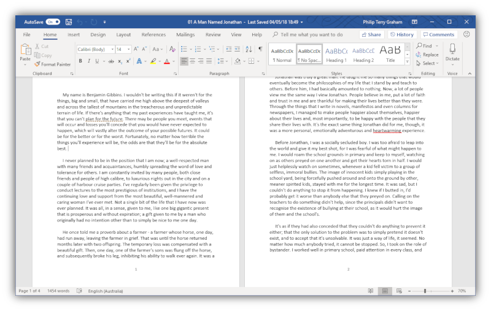
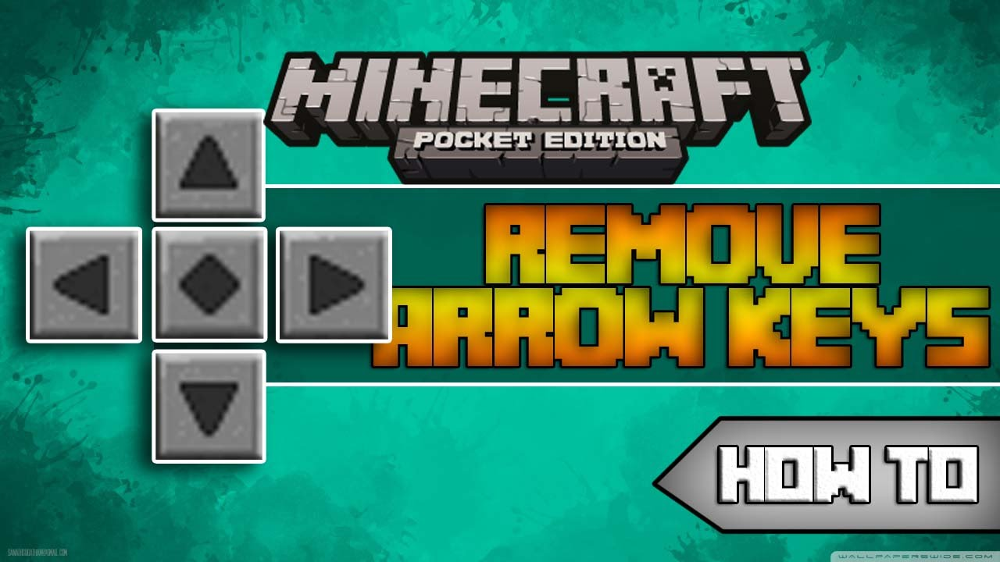
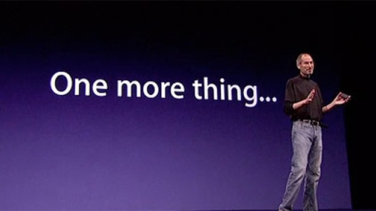
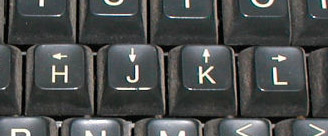

import { Image } from 'mdx-deck'
import { Appear } from 'mdx-deck'
import { Bold, PinkText, Box } from './components/index.jsx';
import { Split } from 'mdx-deck/layouts'
import { Head } from 'mdx-deck'
export { dark as theme } from 'mdx-deck/themes'

<Head>
  <title>VIM presentation</title>
  <meta name='twitter:card' content='summary_large_image' />
  <meta name='twitter:site' content='@hxuanhung' />
  <meta name='twitter:title' content='VIM presentation' />
  <meta name='twitter:description' content='just another cool stuff to share' />
  <meta name='twitter:image' content='https://example.com/card.png' />
</Head>

 
---
# How Vim's keybindings change my developer life
#### @hxuanhung
###### 20/09/2018
---
# About Me
- 🚴‍♀️ 🏃‍♂️
- ❤️ boardgames with friends
- I don't have a 😸
---
# VIM - Another text editor
---
# <del>not this one</del>
 
---
# But...why VIM?
 
---
 
---
 
---
# VIM's basics
---
# VIM's modes
<Appear>
    <Box>
        <Appear>
            <PinkText>normal mode - navigate the structure of the file </PinkText>
            <PinkText><Bold>i</Bold>nsert mode - editing the file </PinkText>
            <PinkText><Bold>v</Bold>isual mode - highlight portions of the file to manipulate at once </PinkText>
        </Appear>
    </Box>
</Appear>
---
# a file = text objects
---
export default Split

 

# Text objects 
```
w - words
s - sentences
p - paragraphs 
```
---
# Motions
```
a - all
i - in 
t - ‘til
```
---
# Commands
```
d - delete
c - change
y - yank (copy)
v - visually select
```
---
 
---
# dw
<Appear>
    delete word
</Appear>
---
# caw
<Appear>
    change all word
</Appear>
---
# yp
<Appear>
    copy paragraph
</Appear>
---
# vi(
<Appear>
    select in ()
</Appear>
---
 
---
 
---
# DEMO 
## VIM
## vscode + vim's keybindings
## Terminal
---
# Beyond that...
---
# vimium
---
# cmd + h/j/k/l
---
# One last thing...😇
---
export default Split

 

# = esc
---
# The end
 
---
# References
karabinet: keys mapping
